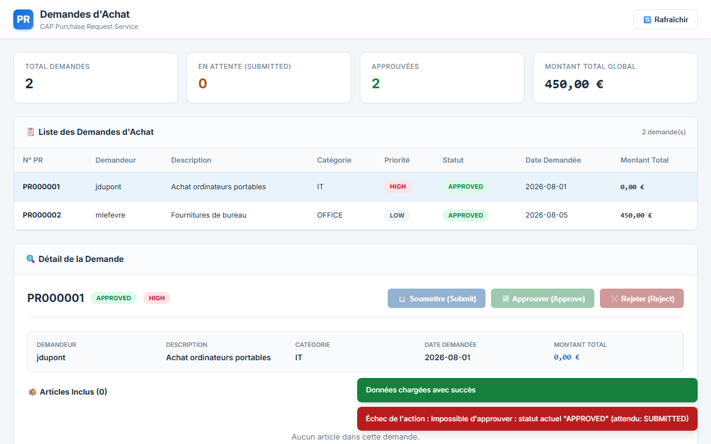

# CAP Purchase Request Service

> Application Node.js basée sur **SAP Cloud Application Programming Model (CAP)** qui étend un backend SAP RAP (RESTful Application Programming) existant avec un workflow d'approbation moderne et une interface web dédiée.

---

## 🏗️ Architecture du Projet

```
┌───────────────────────────┐      ┌─────────────────────────────┐
│  CDS Model (db/schema.cds) │ ───► │  CAP Service (srv/service)  │
└───────────────────────────┘      └──────────────┬──────────────┘
                                                  │
                                                  ▼
┌───────────────────────────┐      ┌─────────────────────────────┐
│    Dashboard UI HTML/JS   │ ◄─── │       OData V4 Endpoint     │
└───────────────────────────┘      └─────────────────────────────┘
```

> **Note d'Architecture :** Le service CAP simule actuellement le service SAP RAP réel (`ZUI_PURCHASEREQUEST`) avec la même structure d'entités et les mêmes actions (`submit`, `approve`, `reject`). Il pourra être connecté directement au service RAP distant via SAP Cloud SDK sans modifier l'interface utilisateur.

---

## 📸 Aperçu & Captures d'Écran

### 1. Liste des Demandes d'Achat (Purchase Requests)
Vue d'ensemble avec les cartes d'indicateurs de performance (KPI) et le tableau récapitulatif.


### 2. Vue Détail avec Articles Inclus
Détail d'une demande sélectionnée incluant la liste des articles et les calculs des montants.


### 3. Action de Soumission ("Submit")
Soumission d'une demande d'achat à l'état `NEW`, faisant passer son statut à `SUBMITTED`.


### 4. Workflow d'Approbation et Rejet
Validation ou rejet d'une demande soumise avec mise à jour en temps réel des métriques et des statuts.


### 5. Gestion des Erreurs et Validations de Transitions
Contrôle strict des transitions de statut avec notification d'erreur en cas d'action invalide.


---

## 🛠️ Stack Technique

- **Framework Backend :** SAP CAP (Cloud Application Programming Model) / Node.js
- **Protocole de Service :** OData V4 (avec Actions personnalisées liées)
- **Base de Données :** SQLite (In-Memory pour le développement rapide)
- **Interface Utilisateur :** HTML5, Vanilla CSS (Design Moderne & Responsive), JavaScript (Fetch API OData V4)

---

## ⚙️ Fonctionnalités Clés

- **Calcul Automatique des Montants :**
  - Recalcul automatique du sous-total `ItemAmount` (`Quantity * Price`).
  - Calcul dynamique et agrégé du `TotalAmount` global au niveau de la demande.
- **Workflow de Validation à États :**
  - Chaîne d'états stricte : `NEW` ➔ `SUBMITTED` ➔ `APPROVED` / `REJECTED`.
- **Validations & Règle Métier :**
  - Impossibilité d'exécuter une action invalide selon le statut actuel.
  - Saisie obligatoire d'un motif de rejet (`RejectReason`) lors du rejet d'une demande.
  - Feedback visuel en temps réel via des notifications Toast.

---

## 🚀 Comment Lancer le Projet

### 1. Installation des dépendances
```bash
npm install
```

### 2. Démarrer le serveur CAP
```bash
npx cds watch
```

### 3. Accéder à l'application
Ouvrez votre navigateur sur :
- **Dashboard UI :** [http://localhost:4004/dashboard/index.html](http://localhost:4004/dashboard/index.html)
- **Service Root CAP :** [http://localhost:4004](http://localhost:4004)

---

## 🤖 Prochaines Étapes

- [ ] **Intégration d'Agents IA :** Déploiement d'un module IA (Copilot) pour l'analyse automatique du contenu des demandes d'achat, la détection des anomalies de prix et l'assistance décisionnelle lors de l'approbation.
- [ ] **Connexion SAP RAP Distant :** Liaison directe du service CAP avec le backend S/4HANA Cloud via `@sap-cloud-sdk/connectivity` et l'endpoint OData V4 `ZUI_PURCHASEREQUEST`.
