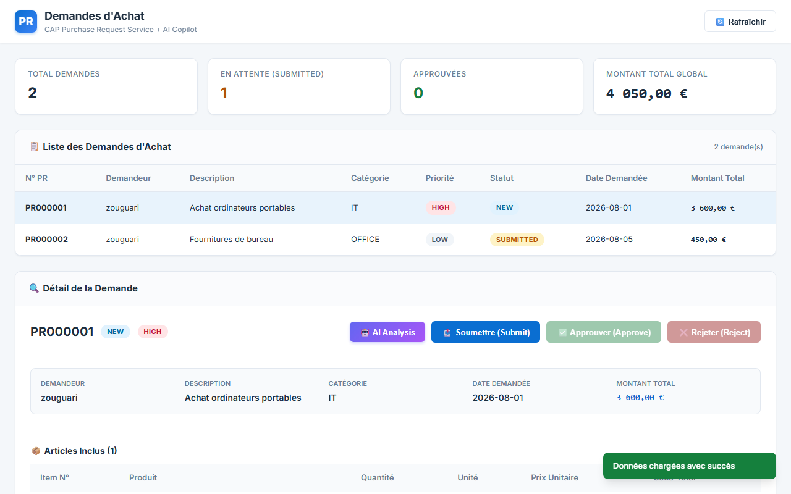
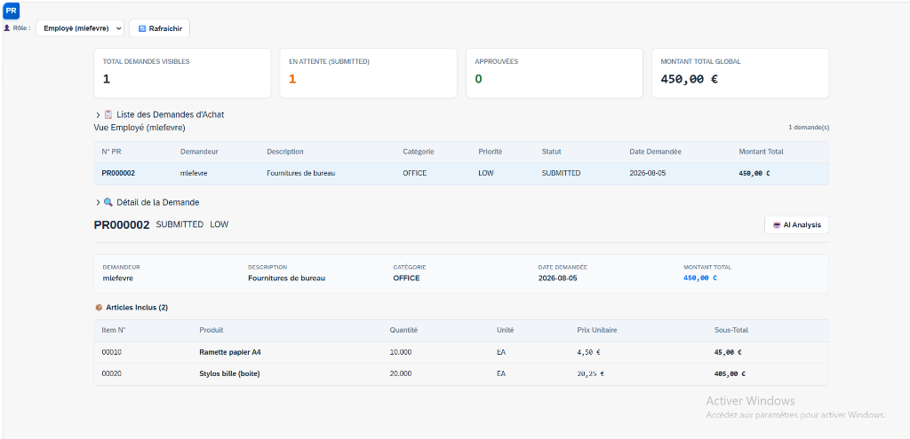
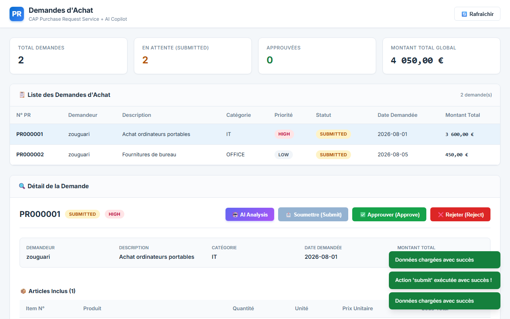
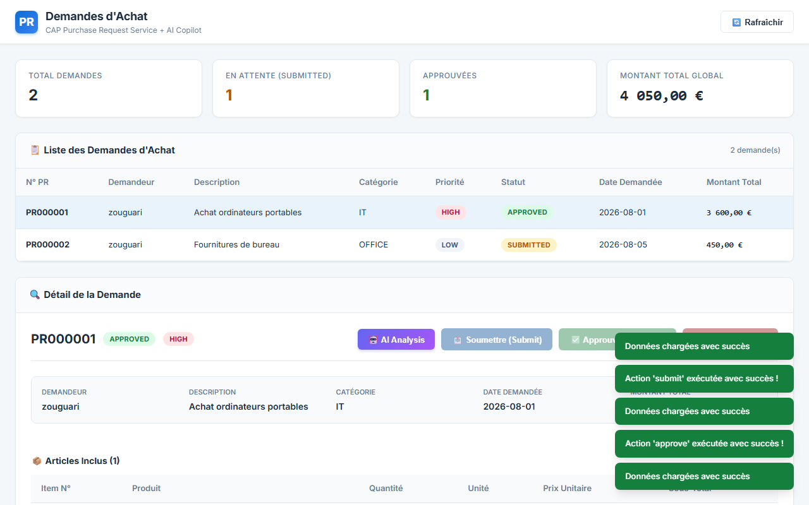
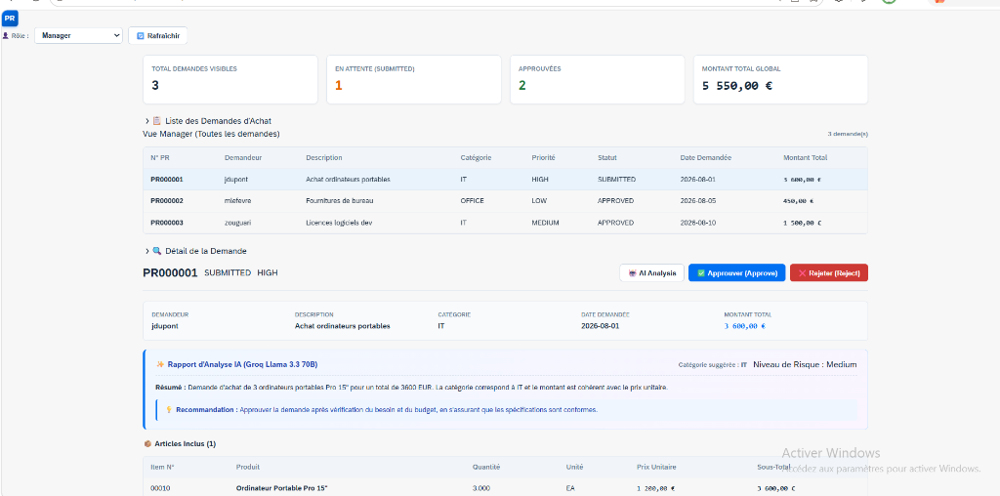
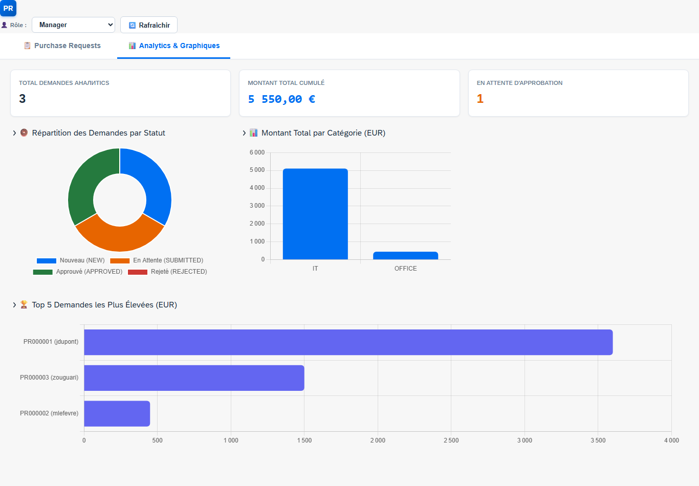

# CAP Purchase Request Service (+ AI Copilot & SAP Fiori UI)

> Application Node.js basée sur **SAP Cloud Application Programming Model (CAP)** qui étend un backend SAP RAP (RESTful Application Programming) existant avec un workflow d'approbation Fiori, une vue analytique interactive (Chart.js), une simulation de rôles par instance (Employé/Manager) et une couche d'analyse intelligente propulsée par l'IA (Groq / Llama 3.3 70B).

---

## 🏗️ Architecture du Projet

```
┌───────────────────────────┐      ┌─────────────────────────────┐
│  CDS Model (db/schema.cds) │ ───► │  CAP Service (srv/service)  │
└───────────────────────────┘      └──────────────┬──────────────┘
                                                  │
                                                  ├──► 🤖 Groq AI API (Llama 3.3 70B)
                                                  │
                                                  ▼
┌───────────────────────────┐      ┌─────────────────────────────┐
│  SAP Fiori UI5 + Chart.js │ ◄─── │       OData V4 Endpoint     │
└───────────────────────────┘      └─────────────────────────────┘
```

> **Note d'Architecture :** Le service CAP simule actuellement le service SAP RAP réel (`ZUI_PURCHASEREQUEST`) avec la même structure d'entités et les mêmes actions (`submit`, `approve`, `reject`). Il pourra être connecté directement au service RAP distant via SAP Cloud SDK sans modifier l'interface utilisateur.

---

## 📸 Aperçu & Captures d'Écran (Interface SAP Fiori)

### 1. Vue Manager — Liste Globale des Demandes d'Achat
Vue globale des demandes d'achat pour le rôle **Manager** avec cartes KPI, ShellBar SAP Fiori et filtres d'affichage.


### 2. Vue Employé — Consultation d'une Demande (`mlefevre`)
Vue restreinte pour un **Employé** (`mlefevre`) ne visualisant que sa propre demande. Les boutons d'approbation/rejet sont masqués.


### 3. Vue Employé — Action de Soumission (`zouguari`)
Soumission d'une demande d'achat `NEW` par son demandeur (`zouguari`), déclenchant la mise à jour à l'état `SUBMITTED` avec notification toast.


### 4. Vue Manager — Action d'Approbation & Rejet
Validation d'une demande soumise par le **Manager** avec notification de confirmation `Action 'approve' exécutée avec succès !`.


### 5. Analyse Intelligente par IA — Rapport SAP Fiori (Groq Llama 3.3 70B)
Rapport d'analyse généré à la volée par l'IA Groq intégré dans le panneau SAP Fiori avec suggestion de catégorie, résumé et recommandation.


### 6. Vue Analytique Interactive (Graphiques Chart.js)
Nouvel onglet Analytics présentant 3 graphiques interactifs (Donut par statut, Barres par catégorie, et Top 5 par montant) calculés en temps réel à partir des données filtrées par rôle.


---

## 🤖 Analyse IA (Groq / Llama 3.3 70B)

### Principe de fonctionnement
Le service intègre une action OData V4 liée `analyzeWithAI()` exécutée à la demande. Elle extrait la demande d'achat et la totalité de ses articles associés, puis sollicite l'API **Groq** via le modèle `llama-3.3-70b-versatile`. 
*Cette analyse est effectuée en lecture seule, sans altération ni écriture en base de données.*

### Données analysées & retournées
L'IA génère un rapport structuré en JSON contenant :
- **Catégorie suggérée :** Reclassification intelligente selon la nature des produits.
- **Niveau de risque :** Évaluation globale (`Low`, `Medium`, `High`).
- **Résumé synthétique :** Explication synthétique en 2 phrases maximum.
- **Détection d'anomalie :** Booléen (`anomaly_detected`) accompagné de sa justification (`anomaly_reason`).
- **Recommandation décisionnelle :** Conseil clair pour l'approbateur.

---

## 📊 Vue Analytique (Chart.js)

L'onglet **Analytics & Graphiques** inclut 3 visualisations interactives calculées dynamiquement côté client :
1. **🍩 Répartition par Statut (Donut Chart) :** Répartition des demandes par état (`NEW`, `SUBMITTED`, `APPROVED`, `REJECTED`) aux couleurs Fiori Horizon.
2. **📊 Montant Total par Catégorie (Bar Chart) :** Aggregation des montants cumulés par secteur de dépense (`IT`, `OFFICE`, etc.).
3. **🏆 Top 5 des Demandes par Montant (Horizontal Bar Chart) :** Classement des 5 plus importantes demandes d'achat par montant total.

---

## 🛠️ Stack Technique

- **Framework Backend :** SAP CAP (Cloud Application Programming Model) / Node.js
- **Design System UI :** SAP Fiori Horizon Theme (`--sapBrandColor`, `--sapBackgroundColor`, police Fiori 72)
- **Composants UI :** `@ui5/webcomponents` v2 (`ui5-shellbar`, `ui5-panel`, `ui5-object-status`, `ui5-badge`, `ui5-button`)
- **Librairie Graphique :** Chart.js v4 (Donut, Bar, Horizontal Bar)
- **Moteur IA :** Groq API (Modèle LLM `llama-3.3-70b-versatile` / `groq/compound`)
- **Protocole de Service :** OData V4 (avec Actions personnalisées `submit`, `approve`, `reject`, `analyzeWithAI`)
- **Base de Données :** SQLite (In-Memory avec initialisation CSV automatique)

---

## 🚀 Comment Lancer le Projet

### 1. Installation des dépendances
```bash
npm install
```

### 2. Configuration des variables d'environnement
Vérifiez ou créez le fichier `.env` à la racine :
```env
GROQ_API_KEY=votre_cle_groq_api
```

### 3. Démarrer le serveur CAP
```bash
npx cds watch
```

### 4. Accéder à l'application
- **Dashboard UI Fiori :** [http://localhost:4004/dashboard/index.html](http://localhost:4004/dashboard/index.html)
- **Endpoint OData V4 :** [http://localhost:4004/odata/v4/purchase-request](http://localhost:4004/odata/v4/purchase-request)
