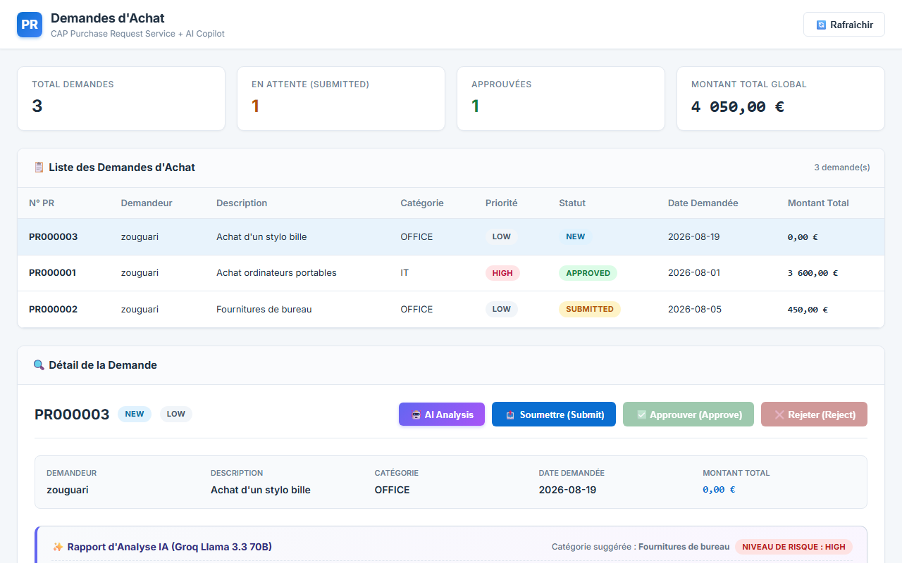

# CAP Purchase Request Service (+ AI Copilot)

> Application Node.js basée sur **SAP Cloud Application Programming Model (CAP)** qui étend un backend SAP RAP (RESTful Application Programming) existant avec un workflow d'approbation moderne et une couche d'analyse intelligente propulsée par l'IA (Groq / Llama 3.3 70B).

---

## 🏗️ Architecture du Projet

```
┌───────────────────────────┐      ┌─────────────────────────────┐
│  CDS Model (db/schema.cds) │ ───► │  CAP Service (srv/service)  │
└───────────────────────────┘      └──────────────┬──────────────┘
                                                  │
                                                  ├──► 🤖 Groq AI API (Llama 3.3 70B)
                                                  │
                                                  ▼
┌───────────────────────────┐      ┌─────────────────────────────┐
│    Dashboard UI HTML/JS   │ ◄─── │       OData V4 Endpoint     │
└───────────────────────────┘      └─────────────────────────────┘
```

> **Note d'Architecture :** Le service CAP simule actuellement le service SAP RAP réel (`ZUI_PURCHASEREQUEST`) avec la même structure d'entités et les mêmes actions (`submit`, `approve`, `reject`). Il pourra être connecté directement au service RAP distant via SAP Cloud SDK sans modifier l'interface utilisateur.

---

## 📸 Aperçu & Captures d'Écran

### 1. Liste des Demandes d'Achat (Purchase Requests)
Vue d'ensemble avec indicateurs de performance (KPI) et tableau des demandes associées à l'utilisateur `zouguari`.


### 2. Vue Détail avec Articles Inclus
Détail d'une demande sélectionnée avec calcul automatique des sous-totaux par article et du montant global (3 600,00 EUR).


### 3. Action de Soumission ("Submit")
Soumission d'une demande d'achat à l'état `NEW`, faisant passer son statut à `SUBMITTED`.


### 4. Workflow d'Approbation et Rejet
Validation ou rejet d'une demande soumise avec mise à jour en temps réel des statuts.


### 5. Gestion des Erreurs et Validations de Transitions
Contrôle des règles de gestion avec affichage d'une notification d'erreur en cas d'action invalide.


### 6. Analyse Intelligente par IA (Détection d'Anomalie)
Rapport d'analyse généré à la volée par l'IA Groq détectant une anomalie de tarif sur une demande suspecte.


---

## 🤖 Analyse IA (Groq / Llama 3.3 70B)

### Principe de fonctionnement
Le service intègre une action OData V4 liée `analyzeWithAI()` exécutée à la demande. Elle extrait la demande d'achat et la totalité de ses articles associés, puis sollicite l'API **Groq** via le modèle `llama-3.3-70b-versatile`. 
*Cette analyse est effectuée en lecture seule, sans altération ni écriture en base de données.*

### Données analysées & retournées
L'IA génère un rapport structuré en JSON contenant :
- **Catégorie suggérée :** Reclassification intelligente selon la nature des produits.
- **Niveau de risque :** Évaluation globale (`Low`, `Medium`, `High`).
- **Résumé synthétique :** Explication synthétique en 2 phrases maximum.
- **Détection d'anomalie :** Booléen (`anomaly_detected`) accompagné de sa justification (`anomaly_reason`).
- **Recommandation décisionnelle :** Conseil clair pour l'approbateur.

### Exemple concret (Preuve de détection d'anomalie)
Test réalisé sur un cas suspect (Demande d'achat d'un stylo bille à **50 000,00 EUR**) :

```json
{
  "@odata.context": "../$metadata#AIAnalysisResult",
  "category_suggestion": "Fournitures de bureau",
  "risk_level": "High",
  "summary": "Demande d'achat pour un stylo bille bleu d'un montant total de 50 000 EUR. Le prix unitaire semble anormalement élevé.",
  "anomaly_detected": true,
  "anomaly_reason": "Le prix unitaire de 50 000 EUR pour un stylo bille est incohérent avec les tarifs habituels du marché.",
  "recommendation": "Vérifier la cohérence du prix avec les fournisseurs avant toute approbation."
}
```

---

## 🛠️ Stack Technique

- **Framework Backend :** SAP CAP (Cloud Application Programming Model) / Node.js
- **Moteur IA :** Groq API (Modèle LLM `llama-3.3-70b-versatile` / `groq/compound`)
- **Protocole de Service :** OData V4 (avec Actions personnalisées `submit`, `approve`, `reject`, `analyzeWithAI`)
- **Base de Données :** SQLite (In-Memory avec initialisation CSV automatique)
- **Interface Utilisateur :** HTML5, Vanilla CSS (Design Moderne & Responsive), JavaScript (Fetch API OData V4)

---

## ⚙️ Fonctionnalités Clés

- **Calcul Automatique des Montants :**
  - Recalcul dynamique de `ItemAmount` (`Quantity * Price`).
  - Agrégation automatique du `TotalAmount` global.
- **Workflow de Validation à États :**
  - Chaîne d'états stricte : `NEW` ➔ `SUBMITTED` ➔ `APPROVED` / `REJECTED`.
- **Validations Métier & Sécurité :**
  - Bloquage des transitions non autorisées.
  - Saisie obligatoire d'un motif de rejet (`RejectReason`).
  - Masquage et isolation totale des clés API via des variables d'environnement (`.env`).

---

## ⚠️ Limites Connues

- **Calibrage de la sévérité du risque :** Le niveau de risque (`risk_level`) attribué par le modèle LLM peut parfois être évalué à `Medium` au lieu de `Low` sur certains achats standards ordinaires selon la formulation des descriptions.
- **Base de données In-Memory :** En mode développement local (`cds watch`), la base SQLite est réinitialisée au redémarrage à partir des fichiers CSV.

---

## 🚀 Comment Lancer le Projet

### 1. Installation des dépendances
```bash
npm install
```

### 2. Configuration des variables d'environnement
Vérifiez ou créez le fichier `.env` à la racine :
```env
GROQ_API_KEY=votre_cle_groq_api
```

### 3. Démarrer le serveur CAP
```bash
npx cds watch
```

### 4. Accéder à l'application
- **Dashboard UI :** [http://localhost:4004/dashboard/index.html](http://localhost:4004/dashboard/index.html)
- **Endpoint OData V4 :** [http://localhost:4004/odata/v4/purchase-request](http://localhost:4004/odata/v4/purchase-request)

---

## 🔮 Prochaines Étapes

- **Connexion au backend SAP RAP distant :** Activation de la liaison OData V4 directe avec le service S/4HANA Cloud / BTP (`ZUI_PURCHASEREQUEST`) dès l'obtention des identifiants BTP définitifs. *(Toute l'architecture CDS, les entités et la couche d'orchestration sont déjà prêtes ; seule la configuration de connexion nécessitera une mise à jour).*
